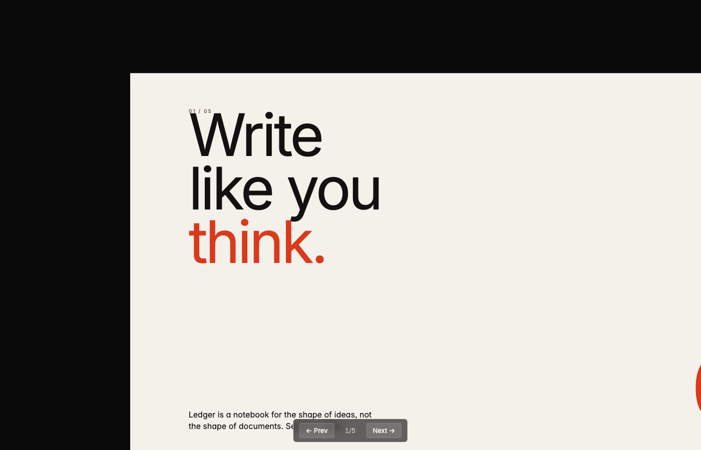
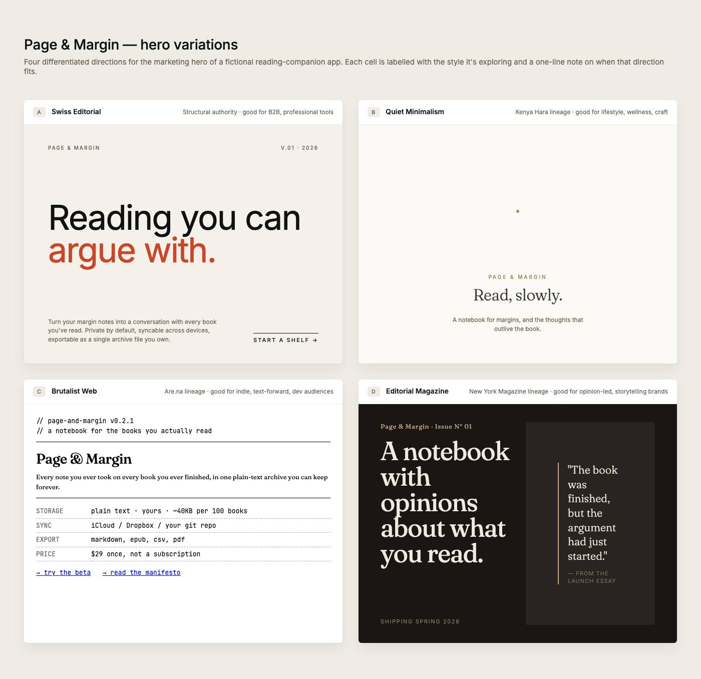
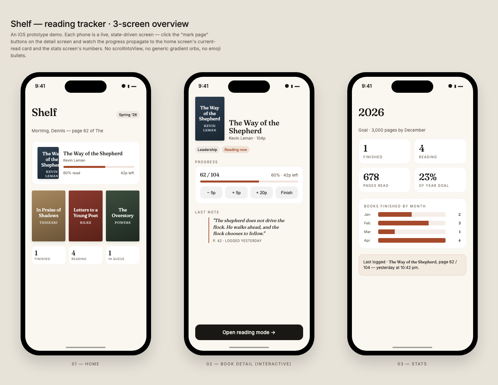

<sub>🌐 <b>English</b> · <a href="README.zh.md">中文</a></sub>

# Claude Design Skill

A portable Claude skill that turns Claude into an expert designer for HTML-based artifacts — landing pages, slide decks, interactive prototypes, animated videos, posters, wireframes, and visual explorations.

Adapted from Claude.ai's internal *Design* product system prompt, restructured to follow the [Claude Skill specification](https://docs.claude.com/en/docs/claude-code/skills) with progressive disclosure (lean `SKILL.md` + on-demand references + copy-paste starter assets + real sample outputs).

---

## Contents

- [What it does](#what-it-does)
- [Skill architecture](#skill-architecture)
- [Installation](#installation)
- [Usage](#usage)
- [When it triggers](#when-it-triggers)
- [Demos](#demos)
- [Test prompts](#test-prompts)
- [Customization](#customization)
- [License](#license)
- [中文 README](README.zh.md)

---

## What it does

When you ask Claude to design something — a deck, a landing page, a prototype, an animation — this skill activates and gives Claude:

- **Fact Verification (Priority #0).** Before assuming anything about a named product, the skill enforces a `WebSearch`. A 10-second search beats 1–2 hours of rework on wrong premises.
- **The Core Asset Protocol.** For branded work, a 5-step hard flow for gathering assets — with **logo / product shots / UI screenshots treated as first-class citizens**, not colors-and-fonts-only. Writes findings to `brand-spec.md`.
- **Design Direction Advisor.** When the brief is too vague ("design me something nice"), the skill switches into advisor mode, proposes 3 differentiated directions from a library of **10 design philosophies** spanning 5 schools, and waits for the user to pick before committing.
- **Output-format playbooks** — design canvas, slide deck, interactive prototype, timeline animation, wireframe. Each with a skeleton and gotchas.
- **Variation strategy** — when to ship N side-by-side options vs. a single prototype with Tweaks (live in-design controls for colors, typography, variants).
- **Anti-slop discipline** — explicit rules against aggressive gradients, emoji bullets, rounded-cards-with-left-border, CSS-silhouettes-as-product-shots, gradient-orbs-representing-AI, and other machine-generated tells.
- **React + Babel traps** that silently break inline-JSX prototypes (style-object scope collisions, Babel scope isolation, integrity hashes).
- **Starter templates** you can copy-paste: a self-scaling deck stage, a design canvas, a prototype shell, a Tweaks-enabled page, a timeline animation engine, and device frames for iOS / Android / macOS / browser.
- **3 real demo artifacts** you can open right now to see what the skill produces.

The skill is **environment-agnostic** — it does not depend on Claude.ai's internal artifact tools. It works in Claude Code, the Claude Agent SDK, or any environment where skills load.

## Skill architecture

```
claude-design-skill/                # repo root — the skill itself
├── SKILL.md                        # entry point — workflow + priority rules + routing
├── README.md / README.zh.md        # bilingual READMEs (skill-agnostic, not read by agents)
├── LICENSE
├── references/
│   ├── fact-verification.md        # Priority #0 — WebSearch before assumptions
│   ├── workflow.md                 # questions, context-gathering, iteration pattern
│   ├── brand-context.md            # Core Asset Protocol — 5-step hard flow
│   ├── design-styles.md            # 10 design philosophies × 5 schools, for Advisor mode
│   ├── design-principles.md        # anti-slop, craft rules, content discipline
│   ├── output-formats.md           # deck / canvas / prototype / animation / wireframe skeletons
│   ├── variations-and-tweaks.md    # variation mix, Tweaks protocol (host + standalone)
│   ├── react-babel.md              # pinned versions, scope rules, integrity hashes
│   └── verification.md             # what to check in a real browser before "done"
├── assets/
│   ├── deck-stage.html             # slide deck with scaling, nav, localStorage, print-to-PDF
│   ├── design-canvas.html          # labeled variant grid
│   ├── prototype-shell.html        # React + Babel loader (pinned + SRI)
│   ├── tweaks-starter.html         # live-editable design with Tweaks panel
│   ├── animations.jsx              # Stage / Sprite / useTime / interpolate / Easing
│   └── device-frames.md            # iOS / Android / macOS / browser frame CSS
├── demos/
│   ├── demo-1-deck.html            # Swiss Editorial 5-slide pitch
│   ├── demo-2-canvas.html          # 4 hero variants across design schools
│   └── demo-3-prototype.html       # Interactive 3-screen iOS reading tracker
├── test-prompts.json               # 6 scenario test cases covering the main branches
└── docs/images/                    # README screenshots
```

The whole repo IS the skill. `SKILL.md` sits at the root, so `npx skills add` and any Agent-Skills-spec-compliant CLI find it immediately.

## Installation

### Option A — `npx skills` (recommended)

Works across 40+ coding agents (Claude Code, Codex, Cursor, OpenCode, Gemini CLI, Cline, …). Install globally:

```bash
npx skills add jiji262/claude-design-skill -g
```

Or into a specific project:

```bash
npx skills add jiji262/claude-design-skill
```

Target a specific agent with `-a` (e.g., `-a claude-code`, `-a cursor`), or use `-y` for non-interactive CI installs. See the full flag list in [the skills CLI docs](https://www.npmjs.com/package/skills).

### Option B — clone + symlink into Claude Code

If you want to track the repo yourself (for customization, contributing, etc.), clone it and symlink into `~/.claude/skills/`:

```bash
git clone https://github.com/jiji262/claude-design-skill ~/code/claude-design-skill
ln -s ~/code/claude-design-skill ~/.claude/skills/claude-design
```

Symlinking (vs. copying) means `git pull` updates the installed skill automatically. Start a new Claude Code session and the skill will auto-register.

### Option C — reference from a plugin

Include this repo (or a subfolder) as a skill inside a Claude Code plugin. See the plugin authoring docs for the expected plugin layout.

### Option D — manual invocation

Without installation, point Claude at [SKILL.md](SKILL.md) directly and ask it to follow the instructions.

## Usage

Just ask Claude to design something. The skill triggers on phrases like:

- "Make a pitch deck for …"
- "Design a landing page for …"
- "Prototype this onboarding flow"
- "Animate this concept"
- "Turn this screenshot into a clickable mockup"
- "Show me 3 options for the hero"
- "Create a poster for …"
- "Build a wireframe storyboard for …"
- "Design something nice — I don't know what style I want" *(triggers Advisor mode)*
- "Make a launch video for <product>" *(triggers Fact Verification + Asset Protocol)*

Claude will:

1. **Verify facts** if the brief names a specific product/version/event — `WebSearch` first.
2. **Gather design context** — push for a codebase, design system, UI kit, or reference brand rather than designing from thin air.
3. **Hunt brand assets** if the task is branded — logo, product shots, UI screenshots, then colors/fonts.
4. **Enter Advisor mode** if the brief is too vague — propose 3 differentiated directions from different schools.
5. **Declare the visual system** before placing pixels.
6. **Build an initial artifact with placeholders**, show it to you early, then iterate.
7. **Ship multiple variations** spanning conservative → novel.
8. **Verify** the artifact loads cleanly in a real browser before calling it done.

## When it triggers

The skill is designed to be "a little pushy" — it activates on common design phrasings even when the user doesn't say the word "design." See the `description` field in [SKILL.md](SKILL.md) for the full trigger list.

It does **not** trigger on general frontend coding tasks (fixing a bug, refactoring a component) — those are handled by regular coding flows, not the design skill.

## Demos

Open these directly in a browser — no build step. Each is a real sample of what the skill produces:

### 1 · Slide deck (Swiss Editorial)

<p align="center"></p>

**[demos/demo-1-deck.html](demos/demo-1-deck.html)** — 5-slide pitch deck, Swiss Editorial style (Pentagram / Vignelli lineage). Oversized folios, hairline rules, one accent color. Keyboard navigation, 1-indexed slide labels, localStorage persistence.

### 2 · Design canvas (4 hero variations across schools)

<p align="center"></p>

**[demos/demo-2-canvas.html](demos/demo-2-canvas.html)** — 4 hero variations for the same fictional product, drawn from 4 different design schools (Swiss Editorial / Kenya Hara minimalism / Brutalist web / Editorial magazine). Shows the Advisor mode pattern in action.

### 3 · Interactive iOS prototype (live state)

<p align="center"></p>

**[demos/demo-3-prototype.html](demos/demo-3-prototype.html)** — Interactive 3-screen iOS reading tracker. Click the "+5p / +20p / Finish" buttons on the detail screen and watch state propagate across all three phones live.

See [demos/README.md](demos/README.md) for a walkthrough of what to notice in each demo.

## Test prompts

[test-prompts.json](test-prompts.json) contains 6 realistic scenario tests, each tagged with the guardrails it exercises:

1. Vague landing-page brief → Advisor mode kicks in
2. Named-brand task → Fact Verification + Core Asset Protocol
3. Pitch-deck → system discipline + scale floors
4. Motion design → time discipline + no gradient-orb-for-AI
5. iOS prototype → real image sources + information density + React pinning
6. Tweaks vs. N separate files → variation strategy

Use these to self-check the skill or seed your own eval harness.

## Customization

- **Add your brand/system as a bundled reference.** Drop your brand guide, design tokens, or UI kit as Markdown/HTML in `references/` or `assets/`, and update `SKILL.md` to point Claude at them.
- **Tighten the trigger surface.** Edit the `description` frontmatter in `SKILL.md` to narrow or broaden when it fires.
- **Swap starter templates.** The files in `assets/` are explicit starting points — rewrite them to match your house style and Claude will use your versions.
- **Extend the style library.** Add entries to `references/design-styles.md` with the same (pitch / flagship / keywords / signature-moves / when-to-use) structure.
- **Add new output formats.** Add a new file under `references/` (e.g., `references/email-designs.md`) and reference it from `SKILL.md`.

## Design philosophy

This skill stays intentionally lean: markdown + small HTML starters + a few sample outputs, nothing binary. The core conviction is that good hi-fi design grows from existing context (brand, codebase, UI kit) rather than from scratch — so the skill's primary job is to make Claude gather real context, commit to a visual system, and avoid the pre-trained path of least resistance that leads to AI-slop. Every rule, reference, and asset here serves that goal.

## License

MIT. See [LICENSE](LICENSE). The original Claude Design system prompt content is Anthropic's; this repository contains an adapted, restructured rendition intended for use with the Claude Skill specification.

## Special Thanks

[linux.do](https://linux.do)
